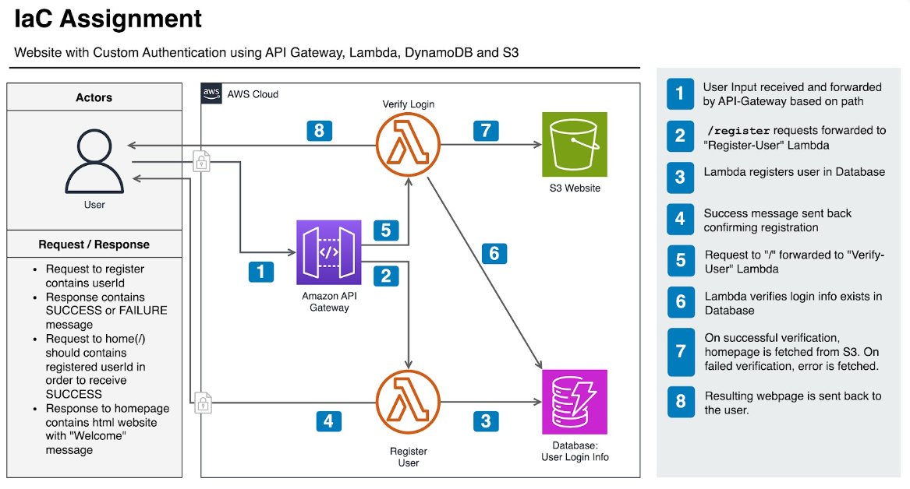

# Infra as Code - Assignment Instructions for IaC Course

## Overview

This is a template repo for participants to use to create their assignment solution for the IaC course. It requires the following steps:

1. Create a new private repo in your personal GitHub account based on a clone of this repo
2. Refactor and implement terraform code in line with the requirements below
3. Deploy the solution successfully using Github Actions
4. Update README.md to provide guidance based on your implementation

So in this IaC course you have been working with AWS VPCs, EC2s, ECS, S3, RDS and DynamoDB but the focus has been to learn Terraform as well as gain some experience with AWS. In order to do that, this assignment is subdivided into three milestones that build on each other. To help guide you through them, this README is structured as follows:

1. **What is API Gateway and Lambda?** Provides further resources about the stack we will be using to implement the assignment.
2. **Final Architecture Overview** Provides the details of the functionality expected, as well as how the different services should interact with each other.
3. **Milestones** Provides the scope of what needs to be delivered with each milestone and the respective submission calendar. **Milestones build on top of each other**, meaning that you should also evolve your code as you implement new requirements.

## Table of Contents

- [Infra as Code - Assignment Instructions for IaC Course](#infra-as-code---assignment-instructions-for-iac-course)
  - [Overview](#overview)
  - [Table of Contents](#table-of-contents)
  - [What is API Gateway and Lambda?](#what-is-api-gateway-and-lambda)
  - [Final Architecture Overview](#final-architecture-overview)
    - [API Gateway](#api-gateway)
    - [Request-Processing Lambdas](#request-processing-lambdas)
    - [DynamoDB](#dynamodb)
    - [S3 Bucket](#s3-bucket)
  - [General Implementation Instructions](#general-implementation-instructions)
    - [Least Privilege Principle](#least-privilege-principle)
  - [Automated testing](#automated-testing)
  - [How to Submit your Assignment](#how-to-submit-your-assignment)
  - [Milestones](#milestones)
    - [Milestone 1: Infrastructure Foundation](#milestone-1-infrastructure-foundation)
      - [Objective](#objective)
      - [Acceptance Criteria](#acceptance-criteria)
      - [Automated tests](#automated-tests)
      - [Tasks](#tasks)
    - [Milestone 2: Functional Infrastructure](#milestone-2-functional-infrastructure)
      - [Objective](#objective-1)
      - [Acceptance Criteria](#acceptance-criteria-1)
      - [Automated tests](#automated-tests-1)
      - [Tasks](#tasks-1)
    - [Milestone 3: CI/CD and Advanced Features](#milestone-3-cicd-and-advanced-features)
      - [Objective](#objective-2)
      - [Acceptance Criteria](#acceptance-criteria-2)
      - [Automated tests](#automated-tests-2)
      - [Tasks](#tasks-2)
  - [Shared Responsibility](#shared-responsibility)
  - [Clean Up Instructions](#clean-up-instructions)

## What is API Gateway and Lambda?

If you have not come across these services before then we recommend watching one or more of these videos. The last two videos are more specific in how these services interact with each other which directly relates to this assignment. Obviously these videos use the AWS Console whereas we will be implementing our solution using Terraform.

- [What is Amazon API Gateway?](https://www.youtube.com/watch?v=1XcpQHfTOvs)
- [AWS Lambda In Under FIVE Minutes](https://www.youtube.com/watch?v=LqLdeBj7CN4)
- [Create a REST API with API Gateway and Lambda](https://www.youtube.com/watch?v=jgpRAiar2LQ)
- [Use Amazon API Gateway with AWS Lambda](https://www.youtube.com/watch?v=aH6S_UKxJ-M)

## Final Architecture Overview

This section provides an overview of the functionality that should be implemented **by the end of the last milestone (Milestone 3)**. This overview should help you keep the end-goal in mind, while working progressively through the milestones to build up the final solution. For each Milestone's requirements, please refer to the specific Milestone's section.



As you can see from the diagram above, in this assignment we're going to create a new solution with different AWS services to give you exposure to a serverless architecture. Below you can find a more detailed description of the functionality of each component.

### API Gateway

- It serves as the first point-of-contact for the end-user, and it helps to redirect requests from the user based on the URL.
  - Requests to `/register` are forwarded to the Lambda which handles user registration
  - Requests to `/` are forwarded to the the Lambda which handles user verification
- The simplest option to deploy it using [HTTP API](https://docs.aws.amazon.com/apigateway/latest/developerguide/http-api.html) from AWS, which is a RESTful application.
- For each API-Gateway [route](https://docs.aws.amazon.com/apigateway/latest/developerguide/http-api-develop-routes.html):
  - An [integration](https://registry.terraform.io/providers/hashicorp/aws/latest/docs/resources/apigatewayv2_integration) resource exists to connect the Lambda with it. `AWS_PROXY` is the used integration-type.
  - The [payload format](https://docs.aws.amazon.com/apigateway/latest/developerguide/http-api-develop-integrations-lambda.html) is set to version `2.0`. This is necessary to ensure compatibility with the application code.
  - Required IAM permissions are in place so that API-gateway is able to invoke its connected Lambda function.
- The API-Gateway is [deployed](https://registry.terraform.io/providers/hashicorp/aws/latest/docs/resources/apigatewayv2_deployment) with [$default stage](https://docs.aws.amazon.com/apigateway/latest/developerguide/http-api-stages.html)
- API-Gateway's own public URL can be used to interact with the solution, there is no need for further DNS setup.

### Request-Processing Lambdas

- Each of the two Lambda functions receives a request and will process it based on the query-string parameters in the request.
- The Lambda code is currently in the `src` directory of this template repository. The functionality is as follows:
  - `register_user.py` saves a new used in the respective DynamoDB table.
  - `verify_user.py` checks whether a certain user is present in the DynamoDB table.

### DynamoDB

- A Database is needed here to save `userId` when registering user, and then later also used for verification of user when calling verify-user Lambda function
- The [DynamoDB](https://registry.terraform.io/providers/hashicorp/aws/latest/docs/resources/dynamodb_table) table is setup in the simplest way possible, and it uses `PAY_PER_REQUEST` as the billing mode, to avoid billing of idle resources.

### S3 Bucket

- An S3 bucket serves as a static website, and contains the homepage and error page of your website.
- The Lambda function to verify users fetches the respective HTML page object from the S3 bucket. This also requires the respective IAM permissions to be set up to allow Lambda to perform the necessary read operations.

## General Implementation Instructions

This section provides general instructions and expectations regarding the overall implementation and evolution of your assignment. Milestone-specific instructions are provided in each Milestone's respective section.

1. Create a new private repo based on a clone of this repo.
2. Use the AWS Beach account #160071257600 (TW_CORE_BEACH_R_D) and an AWS region which is suitable in relation to your geographical location for your deployments. For more information on how to access the AWS Beach account see [BEACH.md](./BEACH.md).
3. It's possible you could create resources with the same name as others in this AWS account. To avoid conflicts wherever possible, please use unique names for your resources (e.g. include your initials or firstname/lastname as prefix or suffix). Do not hardcode such values. Terraform offers features you can leverage to avoid hardcoding information.
4. Deploy all resources using Terraform, e.g. no deployments or changes via AWS console.
5. We encourage both developing and using your own Terraform modules, in order to organize your code better, as well as using public modules, in order to get familiar with them. The codebase should provide a balance between the two. We will also provide some hints in a few areas where we encourage the usage of public modules.
6. Avoid code duplication, by using modules and iterations (`for` loops, `for_each` or `count`) whenever possible. We also encourage use of locals and dynamic expressions.
7. We strongly recommend adding CloudWatch log groups to your Lambda as it will really help when troubleshooting any testing of the application.
8. We strongly recommend following the Least Privilege Principle when implementing your IAM policies (see next section for a brief discussion).
9. Update your repositories README making an assumption that it's the first time the person has come across your code therefore you should explain and guide them through how to use it. Feel free to expand on some of the key decisions you've made in your design, as well as add informative comments where you see fit.
10. Please do bite-sized frequent commits to the repo.
11. Update the `.gitignore` file to prevent commits of unnecessary files in the repo.

### Least Privilege Principle

Both Lambda functions require an IAM role to be associated with them which have permissions to interact with other AWS services like DynamoDB. As an infra engineer, we should always operate with a security best practice mindset and adhere to the least privilege principle. For example, we can allocate permissions like the policy statement below; however, that would be too open (the wildcard `*` allows everything). You should be able to restrict what actions are allowed and restrict what resources the actions can be applied to. **Keep this principle in mind when implementing your IAM policies.**

```
{
    "Effect": "Allow",
    "Action": "dynamodb:*",
    "Resource": "*"
}
```

## Automated testing

In any real-world project, it's essential to have an automated way of asserting the functionality of our application and that new changes introduce no bugs into existing features. Therefore, this assignment also has an element of creating your automated tests to verify functionality.

**Each milestone should also include automated tests.** Here are some more details about it:

- You are free to choose the tool for testing (a few examples include a shell script, a python script, terratest, the native terraform test framework, among others).
- Since the trainers might not be familiar with the chosen tool, please include detailed instructions in your README on how to set it up.
  - Example: if it is a Python script leveraging `pytest`, it should include the instructions to create a virtual environment, as well as a `requirements.txt` file and the instructions to both install the dependencies and run the tests.
  - Think from the perspective of someone who is setting up the tests for the first time: What are the necessary steps until the tests are green?
- Each milestone will contain the required tests to be implemented under its respective "Automated tests" section.
  - Those mentioned in the section are required, and you are free to implement more tests if you wish to do.
- Please add all your tests under a folder named `tests`.

## How to Submit your Assignment

The assignment is to be submitted gradually (each milestone). Please [tag the git commit](https://stackoverflow.com/questions/787797/how-do-i-commit-a-git-tag) that represents the milestone submission with `milestoneX`, where `X` indicates the respective milestone. For example, if you are submitting the first milestone, tag the commit with `milestone1`.

Please fill out the [Submission Form](https://forms.gle/rvEWxrvKCGEaTNAXA) once you are ready to submit a milestone.

Contact your trainers and ask for their GitHub usernames, so you can explicitly grant permission for them to access your repo. In addition, please also grant the Academy the permission to access your assignment repo (GitHub username: `slehong`).

## Milestones

Now that we are familiar with the overall application and architecture components, this section dives deeper into the specific milestones of the assignment. Each milestone section is structured as follows:

- **Objective:** Provides a high-level overview of the concepts in focus and the milestone's main goal.
- **Acceptance Criteria:** Lists the requirements that the submitted code must deliver.
- **Tasks:** Provides a more detailed breakdown of the different steps necessary to deliver the acceptance criteria.

### Milestone 1: Infrastructure Foundation

#### Objective

This milestone focuses on laying the groundwork by focusing on the basic setup of Terraform resources, emphasizing IaC fundamentals and syntax. The following skills are in focus:

- **IaC Fundamentals:** Initialization, local state, basic Terraform resources.
- **Terraform Syntax:** Using HCL syntax, variables, and outputs.
- **Best Practices:** Resource naming and security considerations.

#### Acceptance Criteria

Follow the instructions in the **How to Submit your Assignment** section for submitting this milestone.

Please provide a README file with an overview of your project and with instructions for:

- How to deploy the infrastructure.
- How to test the deployed infrastructure.
- How to destroy the infrastructure (provide steps for how to destroy resources such as non-empty S3 buckets).

After executing the deployment steps in the README, instructors:

- Should be able to retrieve the API Gateway URL from a terraform output.
- Should be able to query the API Gateway URL `/` endpoint and receive a `Hello world` response from the underlying Lambda function.
- Should be able to execute your automated tests and see them passing by following the instructions in your README.
- Should be able to access the CloudWatch Logs of the executed Lambda in the AWS console.

#### Automated tests

This milestone should include automated tests that:

1. Send an HTTP request to the API Gateway URL `/` endpoint and verify that the response includes the string `Hello world`.

#### Tasks

- Create a private repository cloned from the template.
- Initialize a Terraform project with local state.
- Implement the following:
  - A Lambda function that returns `Hello world` whenever executed.
  - An API Gateway route that invokes the Lambda function when receiving a `GET` request on the `/` route. Below we provide a few more details and resources that can support you in this step.
  - The necessary IAM permissions so that API Gateway can invoke the Lambda function.
  - [CloudWatch Logs](https://docs.aws.amazon.com/lambda/latest/dg/monitoring-cloudwatchlogs.html) for the Lambda function, since this will make debugging much easier for later milestones.
- Add the necessary outputs mentioned in the **Acceptance Criteria** section, as well as any other relevant output you see fit.
- Update `.gitignore` to exclude unnecessary files.

**API Gateway**

Here are some more details and resources that can support you when defining the API Gateway and integrating it with Lambda.

- Create a [route](https://docs.aws.amazon.com/apigateway/latest/developerguide/http-api-develop-routes.html) for `/`.
- Add the [integration](https://registry.terraform.io/providers/hashicorp/aws/latest/docs/resources/apigatewayv2_integration) resource to connect the Lambda with it. Use `AWS_PROXY` as integration-type.
- Add the correct Lambda permissions to allow API-gateway to invoke its connected Lambda function.
- [Deploy](https://registry.terraform.io/providers/hashicorp/aws/latest/docs/resources/apigatewayv2_deployment) the API Gateway with [$default stage](https://docs.aws.amazon.com/apigateway/latest/developerguide/http-api-stages.html).
- There are no extra DNS requirements in this solution as the API Gateway service provides a public URL which can be used to interact with the solution.

### Milestone 2: Functional Infrastructure

#### Objective

This milestone builds on top of **Milestone 1**, and focuses on expanding the infrastructure with further Terraform features, focusing on iterative logic and modular design. The following skills are in focus:

- **Terraform Features:** Iterative logic (`for_each`, `count`), locals, and dynamic blocks.
- **Terraform State:** Remote state, intermediate resource dependencies and outputs.
- **Test automation:** Verifying application functionality by implementing multiple test cases.

#### Acceptance Criteria

Please update your previous README file with an updated overview of your project and with updated instructions for:

- How to deploy the infrastructure.
- How to test the deployed infrastructure.
- How to destroy the infrastructure (provide steps for how to destroy resources such as non-empty S3 buckets).

After executing the deployment steps in the README, instructors:

- Should be able to deploy the necessary infrastructure for remote state using either the S3-native mechanism (**preferred**, available in recent terraform versions), or the S3 + DynamoDB combination (**less preferred**).
- Should be able to leverage the remote state when deploying the main project.
- Should be able to retrieve the API Gateway URL, and the S3 bucket ARN (and, if using DynamoDB for state locking, the DynamoDB ARN as well) from the terraform output.
- Should be able to register a user by sending a PUT request to the API Gateway `/register?userId=<user id>` endpoint.
- Should be able to verify a user by sending a GET request to the API Gateway `/?userId=<user id>` endpoint.
- Should receive the contents of the `index.html` file stored in S3 bucket upon successful verification.
- Should receive the contents of the `error.html` file stored in S3 bucket upon failed verification.
- Should be able to execute your automated tests and see them passing by following the instructions in your README.

#### Automated tests

This milestone should include automated tests that:

1. Send an HTTP request to the API Gateway URL `/register` endpoint with a **valid** query string and verify that the response includes successful registration information.
2. Send an HTTP request to the API Gateway URL `/` endpoint with the registered user information and verify that the verification succeeds.
3. Send an HTTP request to the API Gateway URL `/` endpoint with a non-registered user and verify that the verification fails.
4. Send an HTTP request to the API Gateway URL `/register` endpoint with an **invalid** query string and verify that the response includes failed registration information.
5. Send an HTTP request to the API Gateway URL `/` endpoint with an **invalid** query string and verify that the response includes failed verification information.
6. Should remain green when running the same test multiple times.
7. Should be independent from other tests, meaning that there shouldn't be dependencies between them. When running any single test in isolation, it should pass.
   1. Example: The test under point 2 (assert successful verification) should not require running the test under point 1 for user registration.

#### Tasks

**General**

- Add the necessary outputs mentioned in the **Acceptance Criteria** section, as well as any other relevant output you see fit.
- Update `.gitignore` to exclude unnecessary files.
- It will be nice to separate the infra code from python and backend code by putting each of them into separate folders.

**S3**

- Create an S3 bucket to host two HTML files (`index.html` and `error.html`) later used by the Lambda function.
  - You can leverage the [S3 public module](https://registry.terraform.io/modules/terraform-aws-modules/s3-bucket/aws/latest), as it gives you an opportunity to experiment with public modules.
  - Another suggestion (if needed) is the [S3 Object](https://registry.terraform.io/providers/hashicorp/aws/latest/docs/resources/s3_object) resource for uploading objects programmatically.

**Remote state setup**

- Create and deploy the necessary infrastructure to enable remote state and state locking only with S3 (**preferred!**) or with S3 and DynamoDB (**less preferred**).
- Update your project to leverage remote state.

**Lambda**

- Set up two Lambda functions (`register-user` and `verify-user`):
  - Use the `for_each` or `count` construct to deploy Lambda functions iteratively, in order to avoid code duplication.
  - Configure the necessary IAM roles for Lambdas with least privilege principle.
  - Ensure that if you make a change to just the Lambda code and rerun the Terraform workflow it will recognise and deploy the changes.
  - The `verify-user` Lambda function should return the contents of the `index.html` file upon successful execution, and of the `error.html` upon failed execution.

**API Gateway**

- Update your API Gateway infrastructure:
  - Create routes for `/register` and `/`.
  - Connect each route with its respective Lambda. Use `AWS_PROXY` as integration-type.
  - Make sure the correct permissions are in place to allow API-gateway to invoke its connected Lambda function.
  - Once again, deploy the API Gateway with the `$default` stage.
- Similarly to Milestone 1, there are no extra DNS requirements and you should be good to go with the API Gateway's public URL.
- Write Terraform outputs for the API Gateway URL.

**DynamoDB**

- Setup the [DynamoDB](https://registry.terraform.io/providers/hashicorp/aws/latest/docs/resources/dynamodb_table) table in the simplest way possible, and it
- Use `PAY_PER_REQUEST` as the billing mode, to avoid billing of idle resources.
- Hint: your DynamoDB `hash_key` should match your query string key.

### Milestone 3: CI/CD and Advanced Features

#### Objective

This milestone builds on top of **Milestones 1 and 2**, and focuses on incorporating automation and further features using Terraform modules and GitHub Actions. The following skills are in focus:

- **GitHub Actions:** CI/CD pipelines for Terraform.
- **Terraform Modules:** Code reuse and structure improvement.
- **Further Terraform Topics:** IAM with OIDC, linting, automated testing, and others.

#### Acceptance Criteria

Please update your previous README file with an updated overview of your project and with updated instructions for:

- How to deploy the infrastructure.
- How to test the deployed infrastructure.
- How to destroy the infrastructure (provide steps for how to destroy resources such as non-empty S3 buckets).

Make sure that the previous acceptance criteria from Milestone 2 are still passing. Instructors:

- Should be able to retrieve successful runs of the GitHub Actions workflow in your repository.
- Should be able to run the GitHub Actions workflow to deploy and destroy infrastructure.
  - Instructors should fork the repository in order to run workflows under their own repo.
  - Please provide instructions on what needs to be adjusted so that instructors can successfuly run the workflows (for example, any secrets or variables that need to be configured).
- Should be able to successfully deploy the application infrastructure by following the README's instructions.
- Should be able to successfully destroy the application infrastructure by following the README's instructions.

#### Automated tests

This milestone does not require writing any additional tests. Instead, the focus is to integrate the tests you wrote so far in your CI/CD pipeline and leverage them during the deployment process.

#### Tasks

**GitHub Actions**

- Set up a GitHub Actions workflow with the following mandatory functionality (an initial template is provided in this repository under `.github/workflows/deploy.yaml`):
  - Deploying and destroying the project's Terraform infrastructure using a remote state.
    - In order to deploy the infrastructure that supports remote state functionality, you'll need to run the Terraform project locally. Set up remote state and your GitHub IAM role resources as an initial Terraform deployment using local state.
    - Optionally, you can also set up the remote state using a github action.
    - You can choose whether you wish to create a single one or two separate workflows for deploying and destroying the infrastructure.
    - All Terraform related workflows that interact with AWS should assume the same GitHub IAM role created in step 8 above.
  - Checking the code formatting.
  - Linting the terraform code with `tflint`.
- You will also need to configure the GitHub IAM role for Actions using OIDC. When doing so:
  - Follow Least Privilege where possible.
  - Make sure that only your repository can assume the created role.
- Extend the GitHub Actions workflow to include steps to run your automated tests to validate the deployed infrastructure and application are working.
- Extend the GitHub Actions workflow to include at least one of the following [extra automated build steps](https://docs.google.com/presentation/d/1468DXJZPzhKKLAlxz6z7zhvYlkNLOaSCHztUYbQNKAI/edit#slide=id.g2c02383fe93_0_0):
  - Security checks: examples are `checkov`, `trivy`, etc.
  - Documentation generation.

**Terraform project**

Your project code should now be fairly extensive, and we can definitely make some progress towards modularizing it.

- Build modules for the resources where you see fit.
  - Consider building your own modules once or twice, so that you get some experience with it.
- Do you see any other potential improvement to the project? Feel free to bring your own ideas, always adding some information around your design decisions in the project's README file.

## Shared Responsibility

- Please remember to destroy your resources after testing your deployment. This will help us keep the costs under control so we can continue to offer these hands on training courses in the future.
- Use the shared account responsibly. Do not create users/static credentials, always use the okta aws access chicklet to get temporary credentials if required and do not store credentials insecurely

## Clean Up Instructions

1. Run your Terraform GitHub Action and ensure it completes successfully to destroy all of your infrastructure. Do double check in the AWS Console (UI) that the resources have been deleted.
2. Run `terraform destroy` locally to destroy your remote state and GitHub IAM role.
